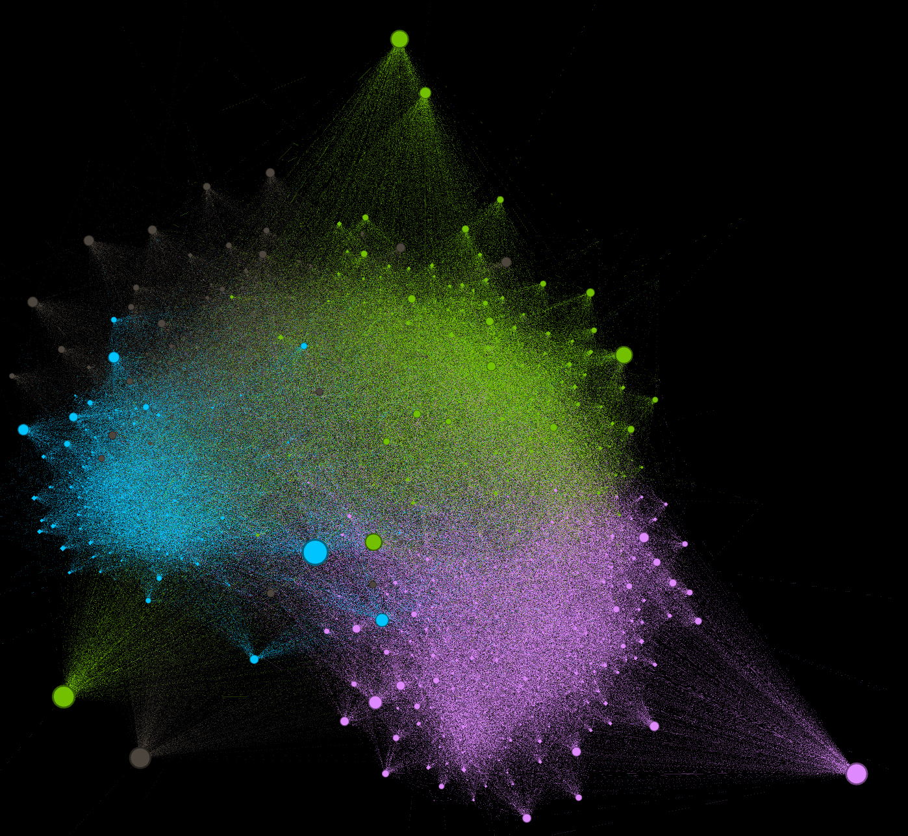
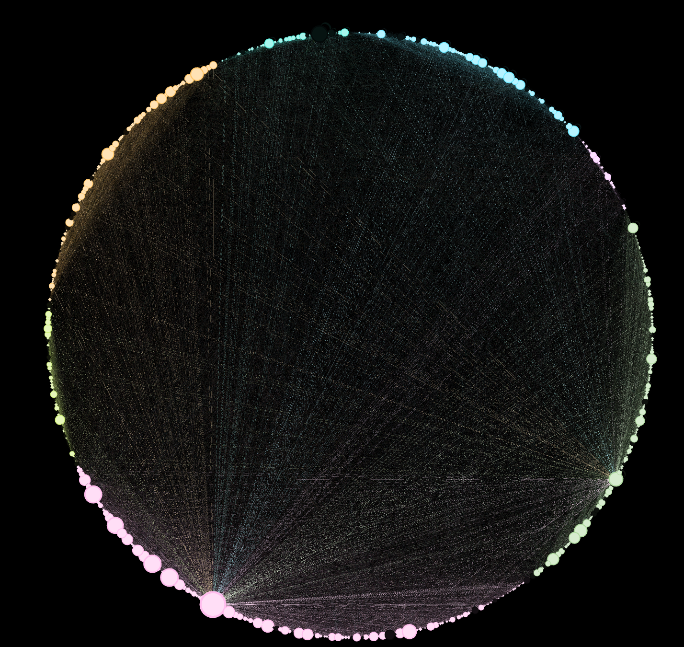
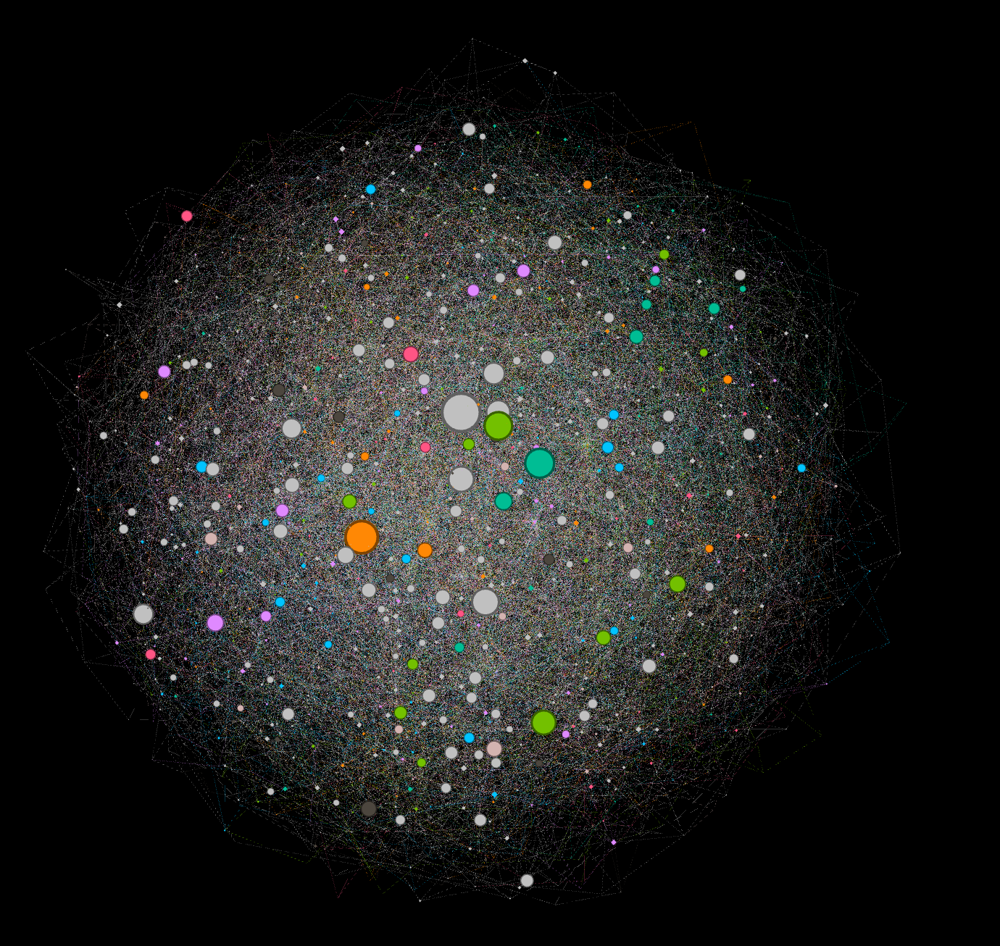

# NetworkScience

This project contains all codes and output of social network analysis. 

Generally speaking, I combine knowledge from Coursera and RPI's Frontier of Network Science course.

### Tool : 
* Neo4j - Graph database
* Stanford - snap python package
* Geiph

### Output

GRQ

 

Wiki

 

EUC

 

Scale Free

 

